# Automation Restaurant

**One connected operating system for a restaurant** — customer ordering, kitchen
tickets, recipes, inventory, suppliers, finance, staff and AI, all on the same
live data.

- Website: https://web-rho-rosy-56.vercel.app
- Each restaurant runs on **its own Supabase project**, created automatically at
  sign-up. One restaurant's data never shares a database with another's.

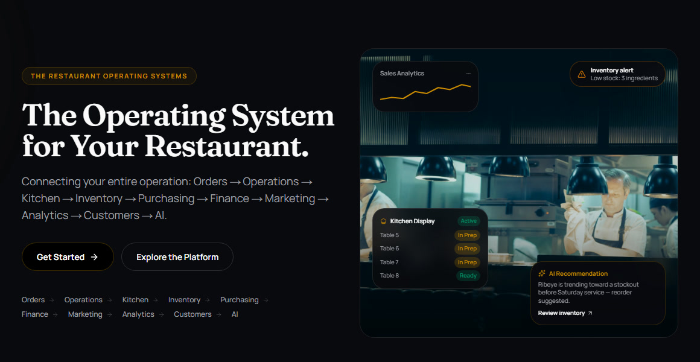

---

## Why Automation Restaurant

| | Unique selling point | What it means for the owner |
| --- | --- | --- |
| 🔗 | **One live data layer** | An order flows to the kitchen, stock, suppliers, finance and the dashboard at once. Nobody re-types anything. |
| 🧾 | **Recipe-driven stock** | Every sale deducts its recipe's exact grams, millilitres and pieces, so food cost is known per dish as it sells. |
| 🍗 | **Shared-ingredient availability** | When chicken runs low, every dish that uses it is recalculated. Guests only see what the kitchen can actually make. |
| 🤖 | **AI Smart Import** | Upload an existing menu, recipe, inventory or supplier PDF. AI builds a draft, and nothing is saved until the owner approves it. |
| 💬 | **AI on every side** | The owner assistant answers from live data and reads or writes PDFs. Guests get a menu assistant, and visitors get a website AI Guide. |
| 📱 | **QR ordering, no app** | Guests scan the table, order, track it live from kitchen to table, order more and leave feedback. They never sign up. |
| 💰 | **True profit, live** | Every sale, refund, food cost, expense, supplier bill and cash movement is written to one financial ledger as it happens, so P&L, payables and the day close always agree. Exported as a branded PDF or Excel file. |
| 🔁 | **Closed purchasing loop** | Low stock → purchase order → goods received → stock updated → supplier bill due on that supplier's terms. |
| 🛡️ | **Portals built from permissions** | Each staff portal is composed from individual permissions, enforced by the database rather than just hidden buttons. |
| 🏢 | **A database per restaurant** | Every restaurant gets its own Supabase project, provisioned automatically at sign-up. |

## Screenshots

<table>
  <tr>
    <td width="50%">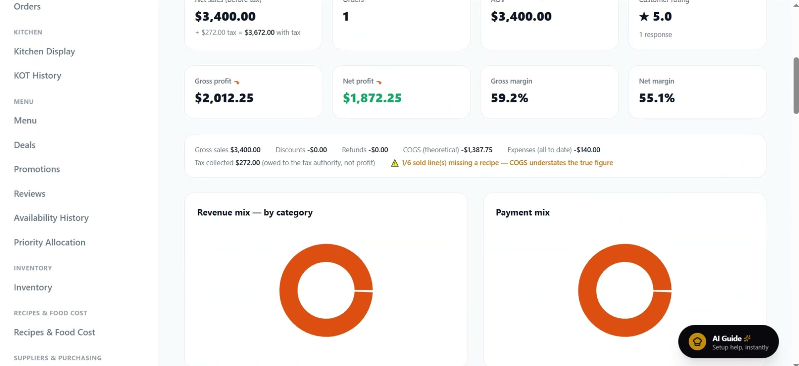<br><b>Owner dashboard</b>: net sales, tax, gross and net profit, margins, revenue and payment mix</td>
    <td width="50%">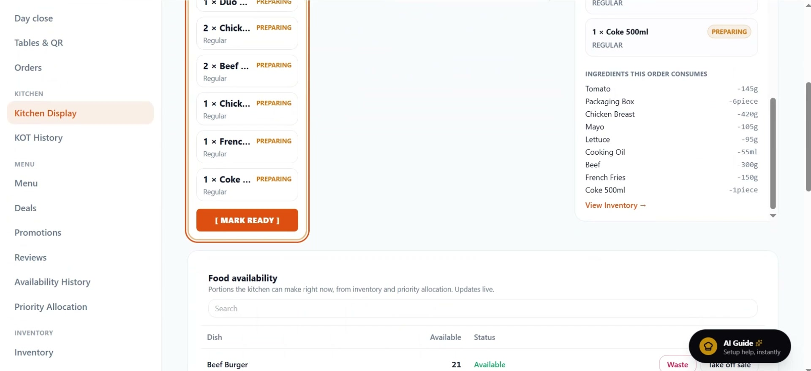<br><b>Kitchen Display</b>: live tickets, the ingredients each order consumes, and portions left</td>
  </tr>
  <tr>
    <td>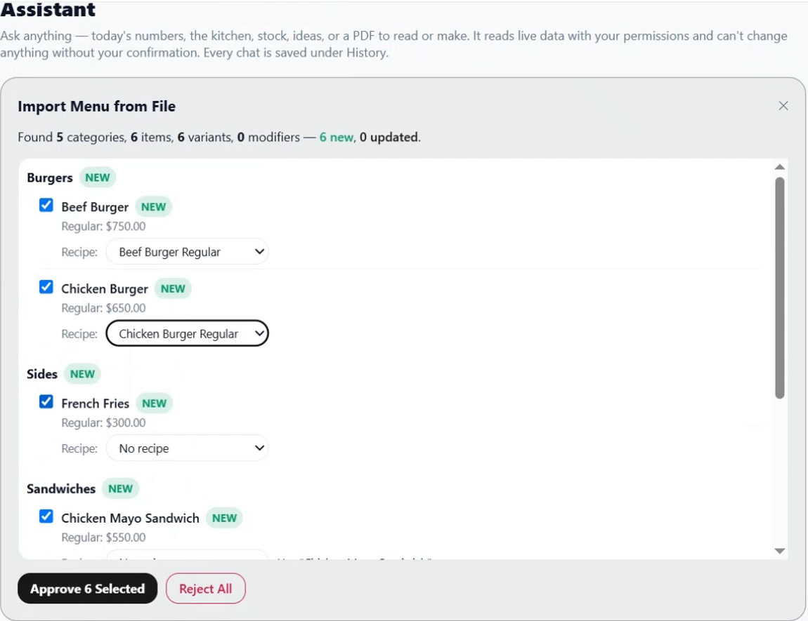<br><b>AI Smart Import</b>: a menu PDF becomes 6 new items in 5 categories, each linked to its recipe, ready to approve</td>
    <td>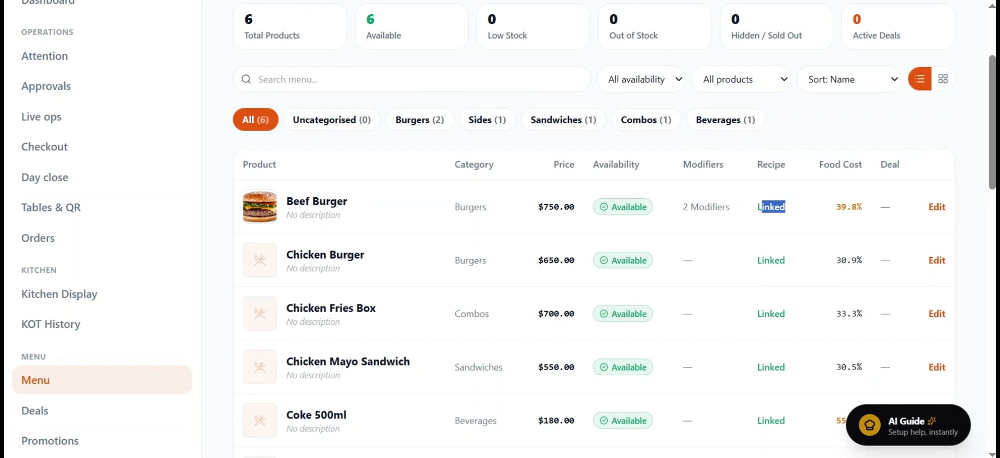<br><b>Menu management</b>: price, availability, linked recipe and food cost % per dish</td>
  </tr>
  <tr>
    <td>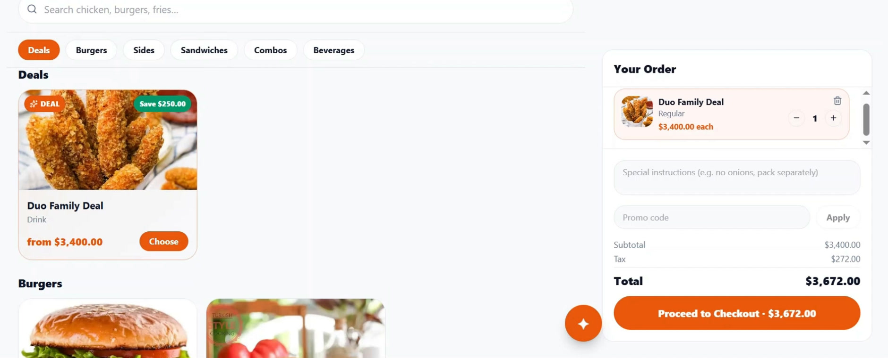<br><b>Customer menu</b>: categories, deals that show the saving, notes, promo codes and tax before checkout</td>
    <td>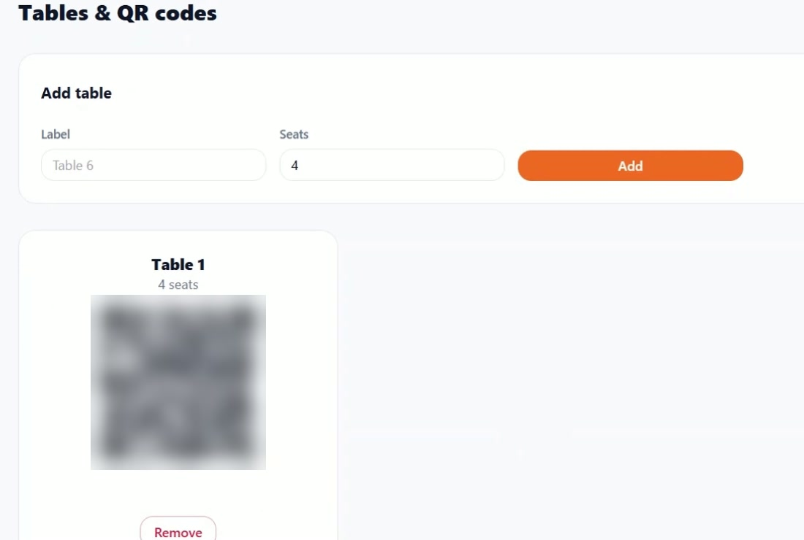<br><b>Tables &amp; QR codes</b>: every table gets its own QR code (blurred here)</td>
  </tr>
  <tr>
    <td>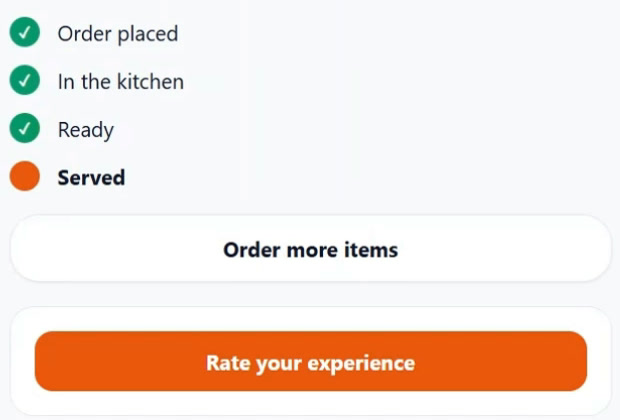<br><b>Order tracking</b>: placed → in the kitchen → ready → served, plus order more</td>
    <td>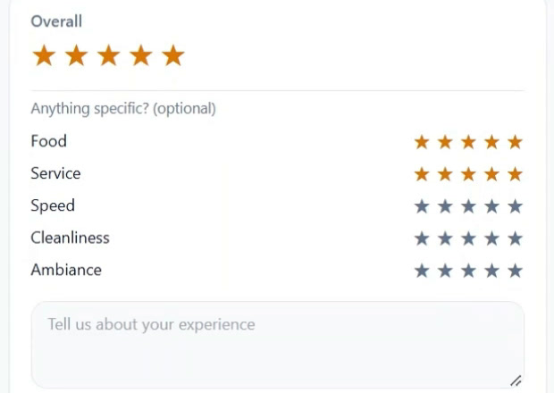<br><b>Guest feedback</b>: overall rating plus food, service, speed, cleanliness and ambiance</td>
  </tr>
  <tr>
    <td>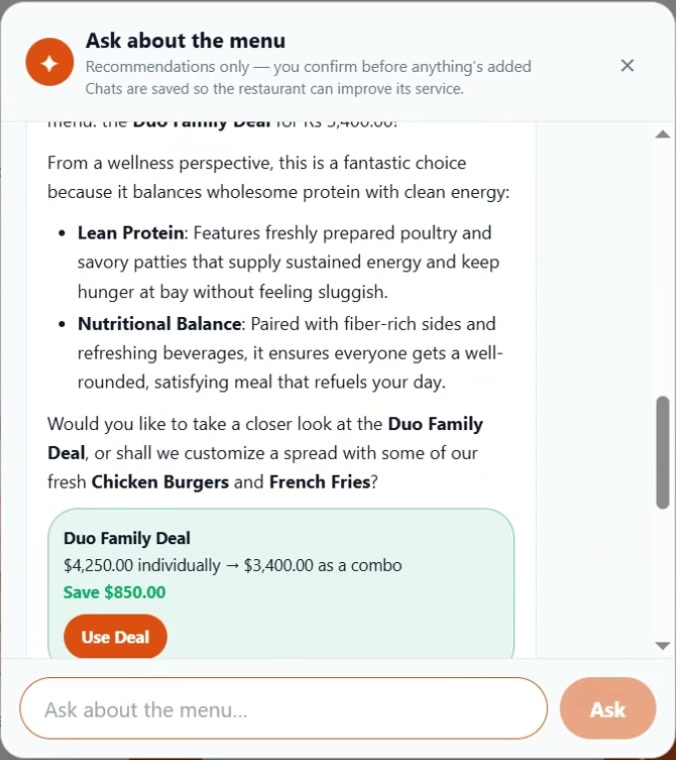<br><b>Customer menu assistant</b>: recommends dishes and calculates real deal savings</td>
    <td>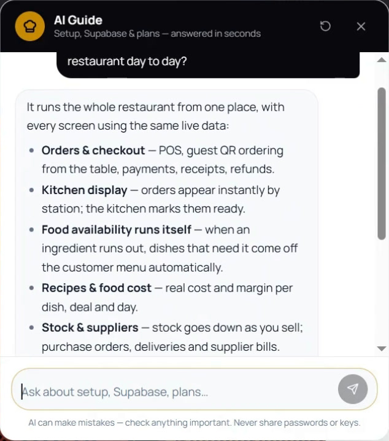<br><b>Website AI Guide</b>: explains the product and walks owners through setup</td>
  </tr>
  <tr>
    <td>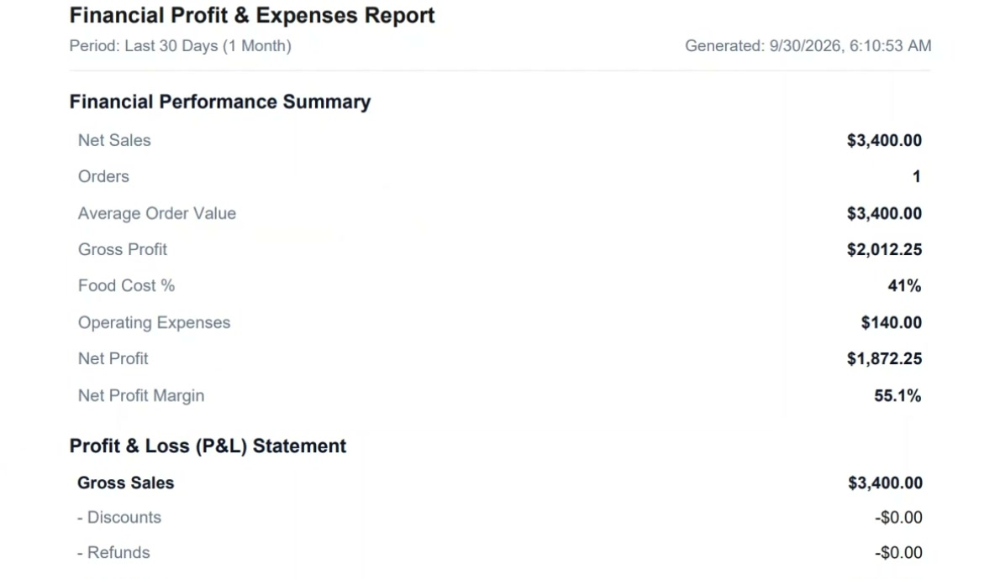<br><b>P&amp;L report</b>: a branded PDF of sales, food cost, expenses and net profit</td>
    <td>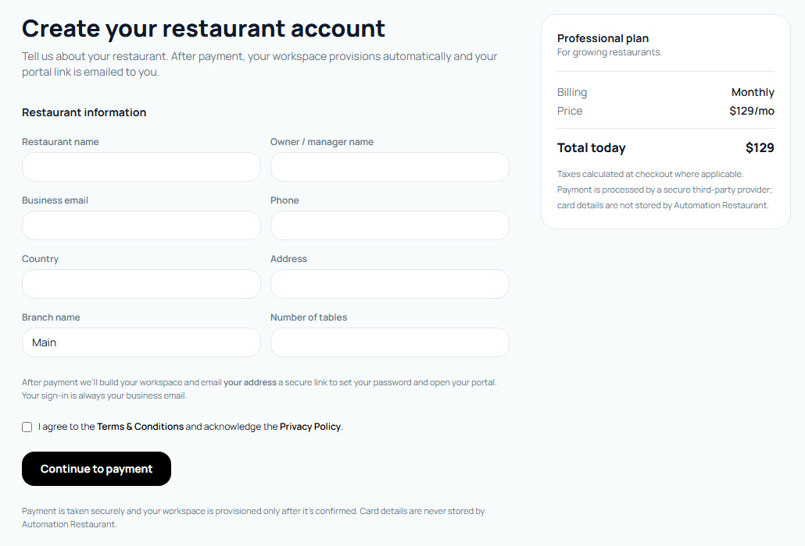<br><b>Sign-up</b>: one form, secure payment, then automatic provisioning</td>
  </tr>
</table>

<sub>Screenshots use a test restaurant with test data.</sub>

---

## What it does

| Area | Features |
| --- | --- |
| **Guests** | Table QR codes, no-login ordering (`/order/<slug>?table=…`), search and categories, deals with the saving shown, special instructions, promo codes, tax shown before checkout, live order tracking (placed → in the kitchen → ready → served), order more from the same table, five-part ratings, "Ask about the menu" AI |
| **Kitchen** | Kitchen Display (KOT queue → preparing → ready), the ingredients each ticket consumes, portions left per dish, KOT history |
| **Menu & recipes** | Categories, variants, modifiers, deals, promotions; recipes in base units (g / ml / piece) linked to dishes; per-dish food cost and margin; availability calculated from stock |
| **Inventory** | Stock on hand, low-stock thresholds and email alerts, automatic deduction by recipe on every order, shared-ingredient impact across dishes |
| **Purchasing** | Supplier directory with payment terms, purchase requests → purchase orders → goods received → stock update → supplier invoices with a 3-way match (PO ↔ delivery ↔ invoice), typed exceptions, credit notes, and AI reading of invoice PDFs and photos |
| **Finance** | Finance overview (P&L vs the previous period, food cost % vs target, payables aging, needs-attention list), append-only ledger with corrections, expense approval workflow, supplier payables, cash movements and a locked day close, branded PDF and Excel finance reports — see [Finance model](#finance-model) |
| **Staff & access** | Staff without logins (name, job, shift), custom portals built from individual permissions with a live preview, approvals, audit log, attendance and scheduling |
| **AI** | Owner assistant (live answers from restaurant data, reads and creates PDFs, every chat saved), Smart Import (upload a menu, recipe, inventory, supplier, table, staff or PO document → reviewable draft → approve), customer menu assistant, website AI Guide |
| **Brand** | Brand Kit (logo, colours, receipt style) applied to the menu, receipts, invoices and reports |
| **Platform** | Marketing site, self-service sign-up and payment, automatic provisioning, plan tiers and upgrades, super-admin console |

## How a restaurant goes live

| Step | What happens |
| --- | --- |
| 1. Sign up | Pick a plan on the website, fill in one form, pay. The owner connects a free Supabase account and a dedicated database is provisioned automatically, then a set-password email is sent. |
| 2. AI import | Upload existing menu, recipe, inventory and supplier files; review the draft (new / changed / missing prices); approve. |
| 3–6. Check the data | Suppliers, inventory (costs and alert levels), recipes (food cost per dish), menu (each dish linked to its recipe). |
| 7. Portals | Give each job its own portal from individual permissions. |
| 8. Order | Guests scan the table QR code, or the cashier rings the order up. |
| 9. Kitchen | The KOT appears on the Kitchen Display; the guest's tracking page follows it. |
| 10. Stock | Every ingredient in the order's recipes is deducted; availability updates. |
| 11. Purchasing | Low stock alerts the owner and drafts a purchase order to the supplier. |
| 12. Results | Dashboard, reports and the AI assistant all read the same numbers. |

## Finance model

Every finance screen, report and AI answer reads from one place: the
**financial ledger** (`financial_events`). Database triggers write an entry
whenever money moves, so nobody re-types figures and the numbers cannot drift
apart.

```
 orders · payments · refunds ─┐
 expenses (approved / paid) ──┤
 supplier invoices · payments ┼──>  financial_events  ──>  Finance overview · Ledger · P&L
 credit notes · stock · waste ┤     (append-only)          Day close · PDF / Excel · AI
 cash movements · day close ──┘
```

### What the ledger records

| Category | Written when | Effect |
| --- | --- | --- |
| Sales | An order is served or paid; reversed on refund or void | Net sales (subtotal − discount − refunds) |
| Food cost | The same orders, using each line's recipe cost | COGS, the same figure the profit report uses |
| Customer payments | Payment taken, refunded or voided | Money held from customers |
| Expenses | An expense is **approved** (never while still a draft or submitted) | Operating cost on its expense date |
| Supplier payables | An invoice is **approved** (+); supplier payment or credit note (−) | What the restaurant owes |
| Inventory and waste | Goods received, stock adjustments, spoilage, at cost | Stock value |
| Cash, day close, purchasing | Till movements, counts, closes, purchase orders | Information only; no balance change |
| Adjustments | A person with **Adjust ledger** posts a correction with a reason | Fixes a figure; nothing existing is changed |

Ledger rows can't be edited or deleted, even by the database owner. A mistake is
fixed by posting a reasoned correction, which is also written to the audit log.

### The workflows

- **Expenses:** draft → submitted → approved → paid (or rejected / void).
  An expense counts as a cost only once it is approved, and it is counted once
  even after it is paid. Receipts are stored in a private bucket.
- **Supplier invoices:** received → 3-way match against the purchase order and
  the goods received → matched or on hold → approved → partially paid / paid.
  - A hold is typed: total, missing PO, supplier, PO mismatch, missing delivery,
    quantity, price, duplicate or other.
  - A rejected invoice keeps its reason and full history.
  - The AI can read an invoice PDF or photo into a draft, but a person always
    reviews and applies it.
- **Cash and day close:**
  - Pay-ins, pay-outs, bank drops and adjustments each need a reason, and none
    can be edited afterwards.
  - The close preview shows sales, payments by method, expected cash and any
    exceptions.
  - Any difference between counted and expected cash needs a reason.
  - A closed day is locked: no new orders, payments, expenses, counts or
    movements can be dated to it. Refunds are still allowed.
  - Reopening a day needs its own permission and a reason.

### Separation of duties

Each step needs its own permission, so the person who records, approves and
pays can be three different people.

| Step | Permission |
| --- | --- |
| Record or edit an expense | `finance.create_expense` / `finance.update_expense` |
| Approve or reject an expense | `finance.approve_expense` |
| Pay an expense | `finance.pay_expense` |
| Create or match a supplier invoice | `invoices.create` / `invoices.match` |
| Approve or reject a supplier invoice | `invoices.approve` (not `payables.manage`) |
| Pay a supplier | `payables.record_payment` |
| Cash movements | `cash.manage` |
| Close / reopen a day | `finance.close_day` / `finance.reopen_day` |
| Post a ledger correction | `finance.adjust_ledger` |
| See food cost and profit | `finance.view_cogs` / `finance.view_profit` |

The owner holds all of them. Other roles and portals get exactly the ones they
are granted, and each one works the same way in a custom portal. Every check runs in the database: hiding a button is never
the only protection. **The AI never approves or pays anything.**

### Finance screens and reports

- **Finance overview** (`/r/<slug>/finance`):
  - Net sales, food cost, gross profit, operating expenses, operating profit and
    payments received, compared with the previous period.
  - Food cost % against the restaurant's target (editable; 30% by default).
  - Money owed to suppliers and overdue.
  - A needs-attention list: unclosed days, invoice exceptions, invoices waiting
    for the 3-way match, expenses awaiting approval.
  - Payables aging (not yet due, 1–30, 31–60, 61–90, 90+ days).
  - A food-cost watch of dishes over target or whose recipe cost rose in the
    last 30 days.
- **Ledger** (`/r/<slug>/finance/ledger`): every entry, filterable by period and
  category, with totals and a link back to the screen where its source record
  is managed.
- **Finance report:** a branded PDF (P&L, expenses, supplier payments,
  purchasing) and an Excel workbook (ledger, payables aging, cash & day close,
  accounts payable, supplier payments, expenses), in the restaurant's own time
  zone.

Operating profit = net sales − food cost − approved expenses dated in the
period.

## Multi-branch

A restaurant on the Enterprise plan (`branches.multi`) can run several
locations from one account. The restaurant is the organization; each location
is a **branch** in the same database. A restaurant with one location keeps
working exactly as before: everything it already has belongs to its default
branch, `MAIN`.

**Shared by every branch:** the menu, recipes, deals, suppliers, staff and
settings.

**Owned by one branch:** orders and their payments, tables and QR codes,
reservations, stock levels and stock movements, low-stock alerts, purchase
orders and supplier invoices, expenses, cash counts and movements, the day
close, shifts and attendance.

| Task | Where | Permission |
| --- | --- | --- |
| Add, edit, deactivate or archive a branch; set the default | Branches | `branches.manage` |
| Limit a portal or a staff member to some branches | Branches → Which branches each login may use | `branches.manage` |
| Give a branch its own price for a dish, or switch a dish off there | Branches → Menu prices by branch | `menu.update` or `branches.manage` |
| Move stock from one branch to another | Inventory (with a branch selected) | `stock.update` |
| See every branch side by side | Finance → Branch comparison, and the dashboard | `finance.view` |

- **Branch selector.** It sits in the portal menu. It shows one branch or All branches, and only lists the
  branches the login may use. Choosing All is for viewing: a new order, a
  stock count or a day close always needs one branch selected.
- **Guest orders.** A table's QR code carries its branch (`/order/<slug>?table=…&b=DHA`).
  The guest sees that branch's prices and dishes, and the order is placed in it.
- **Stock.** `inventory_items.stock_qty` is the total across branches;
  `branch_stock` holds each branch's level. Sales, waste, counts and deliveries
  change only their own branch. A transfer is two stock movements with one
  transfer reference.
- **Day close.** Each branch closes its own day and counts its own cash.
- **Consolidation.** `branch_summary(from, to)` reads the same ledger as the
  Finance pages. Branch rows add up exactly to the restaurant's totals, so
  nothing is counted twice. Entries that belong to the whole restaurant are
  listed on their own.

**Who can see a branch is enforced in the database.**
- A `branch_wall` row-security policy sits on every branch table.
- Reporting functions read branch-scoped views.
- Triggers refuse to move a row into a branch the login may not use.
- The selected branch travels as the `x-branch-ids` request header. It can
  only narrow what a login sees, never widen it.
- In the API, a branch-limited login acts with its own token, so every
  database rule applies to it. An owner viewing one branch gets a service
  client that filters branch tables itself.

Not per branch yet: priority allocation pools, and each branch's timezone and
currency (saved, but the restaurant's own are used, so consolidated totals
stay in one currency and one business day).

## Architecture

```
                 Control-plane Supabase project
                 (tenants, plans, subscriptions, provisioning, registry)
                               │
  website sign-up ──> apps/api ──> Supabase OAuth / Management API
                               │      create project → apply tenant schema → seed roles + settings
                               │
   restaurant A project    restaurant B project    restaurant C project …
   (own auth users, menu,  (fully isolated —       (RLS on every table,
    orders, stock, chats)   own database)           permission-checked RPCs)
```

- **`apps/web`** resolves `/r/<slug>/…` to that restaurant's project and talks to
  it with the signed-in user's JWT, so Row Level Security applies to every read.
- **`apps/api`** handles anything that needs a secret: provisioning, billing,
  e-mail, AI calls, imports and cron jobs. It resolves the tenant and the user's
  permissions from the JWT on the server and never trusts IDs, roles or
  permissions sent by the browser.
- Service-role keys stay on the server and are never sent to the browser.

## Repository layout

| Path | What it is |
| --- | --- |
| `apps/web` | Next.js 15 (App Router): marketing site, sign-up and onboarding, restaurant portal, custom portals, guest ordering, super-admin |
| `apps/api` | Express API (deployed to Vercel as a serverless function): provisioning, billing, staff, AI assistant and imports, customer AI, AI Guide, cron |
| `packages/shared` | Plan tiers and feature entitlements shared by API and web |
| `supabase/control-plane` | Migrations for the central registry project |
| `supabase/tenant-template/schema.sql` | Full schema applied to every new restaurant |
| `supabase/tenant-migrations` | Numbered migrations rolled out to existing restaurants |
| `docs/ai-studio` | System prompt and function declarations exported for Google AI Studio |

## Main routes

| Route | For |
| --- | --- |
| `/`, `/pricing`, `/guide`, `/get-started` | Public website, plans, setup guide, sign-up |
| `/onboarding/…` | Payment confirmation, database connection, provisioning status, set password |
| `/r/<slug>/login` | Staff sign-in for one restaurant |
| `/r/<slug>` | Owner dashboard and every portal page (orders, KDS, menu, recipes, inventory, purchasing, suppliers, finance, staff, AI, settings …) |
| `/r/<slug>/finance`, `/r/<slug>/finance/ledger` | Finance overview and the ledger |
| `/r/<slug>/branches`, `/r/<slug>/finance/branches` | Manage branches; compare branches (Enterprise) |
| `/r/<slug>/portal/<portalKey>` | A custom portal, composed from its permissions |
| `/order/<slug>?table=…` | Guest ordering, tracking and feedback |
| `/admin` | Platform super-admin |

## Plans

| Plan | Monthly | Annual (per month) |
| --- | --- | --- |
| Starter | $49 | $39 |
| Professional | $129 | $103 |
| Enterprise | $299 | $239 |

Features are enforced per plan in both the API and the portal (`packages/shared`).

## Local development

Requires Node.js 20+.

```bash
npm run setup      # install + build packages/shared
npm run dev:api    # API on http://localhost:4000
npm run dev:web    # web on http://localhost:3000
npm run typecheck  # shared + api + web
```

Environment variables (names only — never commit values):

- **`apps/api/.env`** — `SUPABASE_URL`, `SUPABASE_SERVICE_ROLE_KEY` (control plane),
  `SUPABASE_ACCESS_TOKEN`, `SUPABASE_ORG_ID`, `SUPABASE_OAUTH_CLIENT_ID`,
  `SUPABASE_OAUTH_CLIENT_SECRET`, `SUPABASE_OAUTH_REDIRECT_URI`, `APP_URL`,
  `ALLOWED_ORIGINS`, `GEMINI_API_KEY`, `RESEND_API_KEY` or `SMTP_*`, `EMAIL_FROM`,
  `CRON_SECRET`, `STRIPE_SECRET_KEY`, `STRIPE_WEBHOOK_SECRET`, `STRIPE_PRICE_MAP`,
  `PAYMENTS_MODE`. See `apps/api/src/env.ts` for the full list and defaults.
- **`apps/web/.env.local`** — `NEXT_PUBLIC_CONTROL_PLANE_URL`,
  `NEXT_PUBLIC_CONTROL_PLANE_ANON_KEY`, `NEXT_PUBLIC_API_URL`, `NEXT_PUBLIC_SITE_URL`.

## Database changes

Every tenant schema change is done three ways so new and existing restaurants match:

1. Add `supabase/tenant-migrations/NNNN_name.sql`.
2. Mirror it into `supabase/tenant-template/schema.sql`.
3. Bump `SCHEMA_VERSION` in `apps/api/src/provisioning.ts` (currently **103**).

Roll it out to every live restaurant:

```bash
cd apps/api
npx tsx scripts/apply-tenant-migration.ts ../../supabase/tenant-migrations/NNNN_name.sql
```

Never weaken RLS; new tables get policies in the same migration.

## Deployment

Both apps deploy to Vercel from `main`:

- **web** — root `apps/web`, framework Next.js.
- **automation-restaurant-api** — root `apps/api`, served through `api/index.ts`.

Scheduled jobs (low-stock alerts and similar) call the API's cron routes with
`CRON_SECRET`. See `VERCEL_DEPLOY.md` for the web environment variables.

## Test scripts

`apps/api/scripts/` holds end-to-end checks against real tenant projects, for
example `rbac-test.cjs`, `portals-test.cjs`, `realtime-test.cjs`,
`test-recipe-linking.ts`, `test-availability-engine.ts` and
`test-performance-access.ts`.

The finance suites run against every reachable restaurant in one go. Each
database test is a single transaction that is rolled back, so no real data
changes:

```bash
cd apps/api
bash scripts/run-finance-suite.sh
```

It covers the security hardening, ledger, expense workflow, invoice matching,
day close and finance overview suites, a full fictional restaurant day
(`test-finance-scenario.ts`) and cross-restaurant isolation against the live
API (`test-tenant-isolation.ts`).

Multi-branch: `test-branches.ts <project_ref>` (isolation, permissions, plan
limit, per-branch day close, stock, transfers, receiving, branch prices, deals,
consolidation) and `test-branch-fetch.ts` (the owner's branch filter). Any
database suite can rehearse a migration that is not applied yet: set
`PRE_SQL=<file.sql>`, or pass `--with-migration <file.sql>` to
`test-branches.ts`. The migration runs inside the same rolled-back transaction.

## Known limitations

- AI features use Google Gemini; the free quota can run out (HTTP 429/503). Use a paid key for production.
- Stripe price IDs must be set in `STRIPE_PRICE_MAP` before live card payments work.
